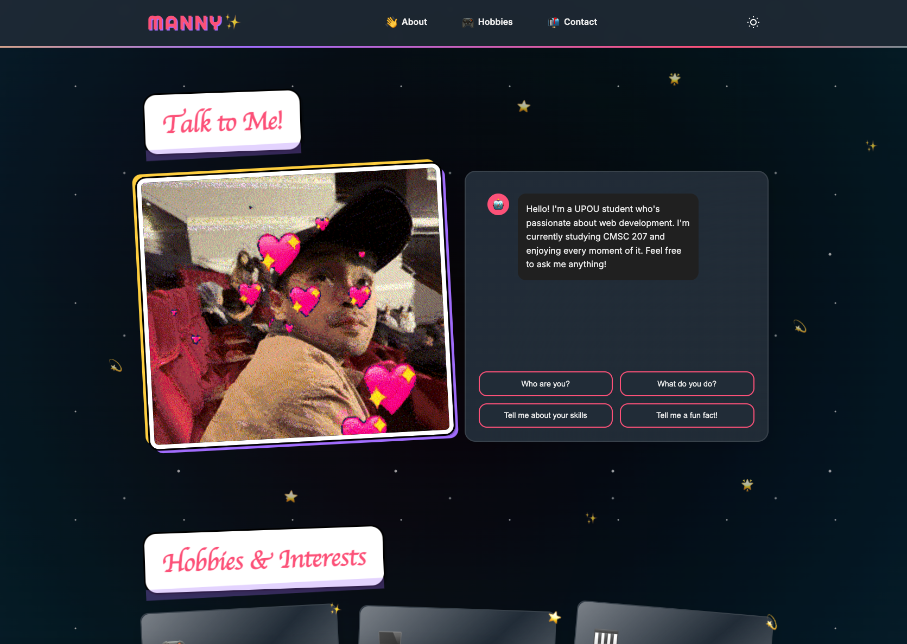
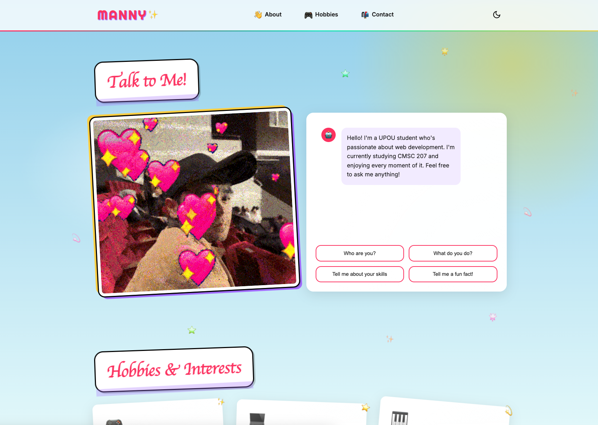
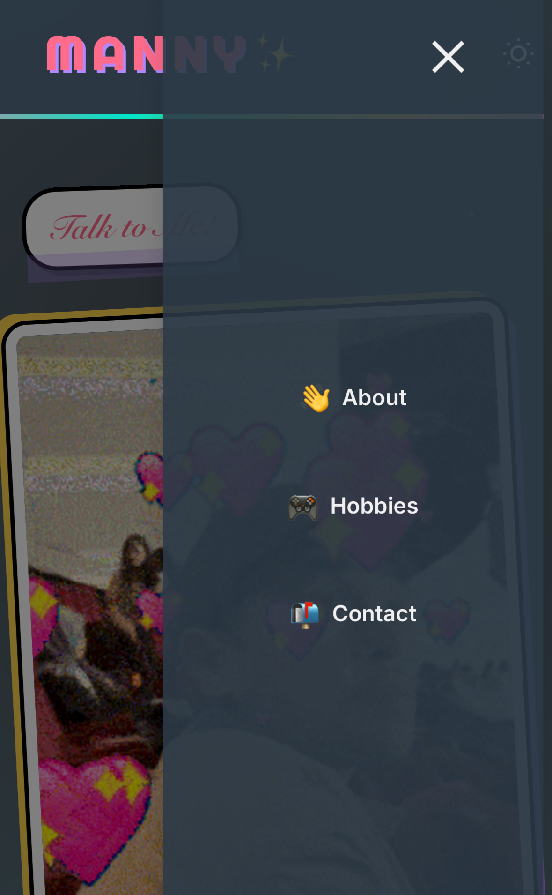
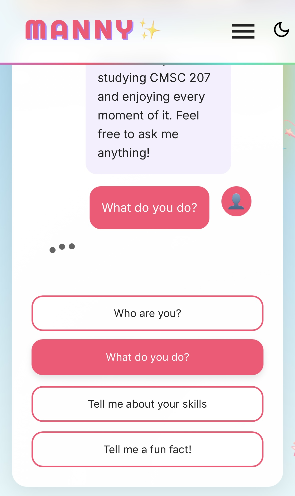

# CMSC 207 Mini-Project | Emmanuel Beltran

A modern, interactive personal portfolio website built for CMSC 207 at UPOU. This portfolio features a clean design with dark/light mode support, an interactive chat interface, and a contact form.

## 🔗 Live Demo

Check out the [live demo](https://upou2024beltran.10021997.xyz/)

## 🌟 Features

- **Interactive Chat Interface**: Engage visitors with a conversational UI
- **Dark/Light Mode**: Toggle between color themes for comfortable viewing
- **Responsive Design**: Fully responsive layout that works on all devices
- **Contact Form Integration**: Working contact form using Web3Forms
- **Modern UI Elements**: 
  - Animated hamburger menu
  - Smooth scrolling navigation
  - Interactive hobby cards
  - Social media links

## 🛠️ Technologies Used

- HTML5
- CSS3
- JavaScript (ES6+)
- Web3Forms API
- Google Fonts
- SVG Icons

## 📸 Screenshots

| Web View |
|:-:|
| Dark Mode | Light Mode |
|:-:|:-:|
|  |  |
| *Dark mode view* | *Light mode view* |

| Mobile View |
|:-:|
| Dark Mode | Light Mode |
|:-:|:-:|
|  |  |
| *Mobile dark mode view* | *Mobile light mode view* |

## 🚀 Getting Started

1. Clone the repository:

```bash
git clone https://github.com/mannyakhol/CMSC207-PROJECT.git
```

2. Open `index.html` in your browser or serve http like so:

```bash
python3 -m http.server 8000
```

## 👤 Author

Emmanuel Beltran
- Email: epbeltran@up.edu.ph

## 🙏 Acknowledgments
- Web3Forms for the contact form functionality
- Google Fonts for typography
- Icons8 for SVG icons
